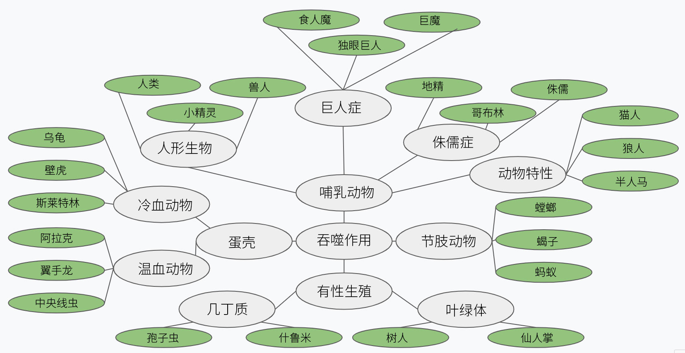

# Evolve

## Play

https://pmotschmann.github.io/Evolve/

## About

An incremental game about evolving a civilization from primordial ooze into a space faring empire.
Evolve combines elements of a clicker with an idler and has lots of micromanagement.

What will you evolve into?

……

# 螺旋进化（evolve）

---

### 描述：

* 单机网页放置文字策略游戏，运行于web浏览器；
* 螺旋进化|进化游戏|螺旋进化汉化版|放置游戏|网页游戏
* 当前版本：0.4.34-20190723。

---

### 测试：

测试版：http://jarol.gitee.io/evolve/   
汉化版：http://likexia.gitee.io/evolve/    
英文版：https://https://pmotschmann.github.io/evolve/    
测试档：https://gitee.com/jarol/tol/blob/master/save   

---

### 汉化：

---

### 进化：

<table id='table1'>
<th colspan=5>物种特质</th>
<tr>
<td>1</td><td>Adaptable</td><td>trait_ambidextrous</td><td colspan=2>用双手工作的自然能力可以提高你的工艺水平。</td>
</tr><tr>
<td>2</td><td>Adaptable</td><td>trait_analytical</td><td colspan=2>你的种族有一个增强的分析头脑，增加你的知识增益。</td>
</tr><tr>
<td>3</td><td>Angry</td><td>trait_angry</td><td colspan=2>你的种族在饥饿时会很快发火。</td>
</tr><tr>
<td>4</td><td>Armored</td><td>trait_apex_predator</td><td colspan=2>你是一个非常危险的捕食者。狩猎和战斗力提高，但装甲技术是不可用的。</td>
</tr><tr>
<td>5</td><td>Arrogant</td><td>trait_armored</td><td colspan=2>你的种族是天生覆盖着装甲，因此在战斗中更难受到致命伤害。</td>
</tr><tr>
<td>6</td><td>Asymmetrical</td><td>trait_arrogant</td><td colspan=2>你们种族固有的自大往往会导致你们在谈判中付出过高的代价。</td>
</tr><tr>
<td>7</td><td>Asymmetrical</td><td>trait_asymmetrical</td><td colspan=2>你的物种是不对称的。这给了你一个更可怕的外观，使贸易更难进行。</td>
</tr><tr>
<td>8</td><td>Atrophy</td><td>trait_atrophy</td><td colspan=2>如果吃不饱，你的种族萎缩得更快。</td>
</tr><tr>
<td>9</td><td>Beast</td><td>trait_beast</td><td colspan=2>你的种族敏锐的感官帮助你发现猎物的气味。</td>
</tr><tr>
<td>10</td><td>Beast</td><td>trait_beast_of_burden</td><td colspan=2>当你赢得一场军事冲突时，你的种族能够带走更多的战利品。</td>
</tr><tr>
<td>11</td><td>Beast</td><td>trait_brute</td><td colspan=2>你的种族热爱战斗，而且更容易招募新兵来参加战斗。</td>
</tr><tr>
<td>12</td><td>Beast of Burden</td><td>trait_carnivore</td><td colspan=2>你的物种是食肉动物，不从事农业。</td>
</tr><tr>
<td>13</td><td>Brute</td><td>trait_cautious</td><td colspan=2>你的种族在雨雪天战斗力会减弱。</td>
</tr><tr>
<td>14</td><td>Carnivore</td><td>trait_chameleon</td><td colspan=2>你的物种天生喜欢隐藏，从而更厌恶拥有常备军。</td>
</tr><tr>
<td>15</td><td>Cautious</td><td>trait_claws</td><td colspan=2>你的比赛在战斗中更高效。</td>
</tr><tr>
<td>16</td><td>Cautious</td><td>trait_cold_blooded</td><td colspan=2>你的物种对外界温度很敏感。</td>
</tr><tr>
<td>17</td><td>Cautious</td><td>trait_compact</td><td colspan=2>你体型很小，因此不需要很多材料来建造东西。</td>
</tr><tr>
<td>18</td><td>Chameleon</td><td>trait_conniving</td><td colspan=2>你暗算他人的方式使你能谈下最棒的交易。</td>
</tr><tr>
<td>19</td><td>Claws</td><td>trait_content</td><td colspan=2>你的种族天生满足，减少了日常生活中的压力。</td>
</tr><tr>
<td>20</td><td>Cold Blooded</td><td>trait_creative</td><td colspan=2>你的物种天生的创造力会使超级项目的更快发展。</td>
</tr><tr>
<td>21</td><td>Cold Blooded</td><td>trait_cunning</td><td colspan=2>你的种族对追踪游戏有亲和力。</td>
</tr><tr>
<td>22</td><td>Cold Blooded</td><td>trait_diverse</td><td colspan=2>你们物种的多样性特质使得作为一个有凝聚力的军事单位一起行动更加困难。</td>
</tr><tr>
<td>23</td><td>Creative</td><td>trait_dumb</td><td colspan=2>你的种族不容易理解新概念。</td>
</tr><tr>
<td>24</td><td>Diverse</td><td>trait_evil</td><td colspan=2>你的种族是邪恶的。</td>
</tr><tr>
<td>25</td><td>Dumb</td><td>trait_fast_growth</td><td colspan=2>你的物种孕育得很快，因此人口增长比其他物种更快。</td>
</tr><tr>
<td>26</td><td>Fast Growth</td><td>trait_fibroblast</td><td colspan=2>增强的成纤维细胞增加士兵的愈合速率。</td>
</tr><tr>
<td>27</td><td>Fast Growth</td><td>trait_fiery</td><td colspan=2>你的皮肤被邪恶的火焰灼伤，使你成为战场上最可怕的对手之一。</td>
</tr><tr>
<td>28</td><td>Fast Growth</td><td>trait_frail</td><td colspan=2>你的种族很脆弱，在战斗中更容易死亡。</td>
</tr><tr>
<td>29</td><td>Fraile</td><td>trait_frenzy</td><td colspan=2>血的气味会让你的部队疯狂地暂时提高你的士气。你也不受战争贩子的惩罚。</td>
</tr><tr>
<td>30</td><td>Gluttony</td><td>trait_gambler</td><td colspan=2>你的物种沉迷于赌博，赌场能储存更多的钱，并产生额外的收入。</td>
</tr><tr>
<td>31</td><td>Greedy</td><td>trait_gluttony</td><td colspan=2>你的物种总是很饿，会吃得更多。</td>
</tr><tr>
<td>32</td><td>Hard of Hearing</td><td>trait_greedy</td><td colspan=2>你的种族是贪婪的，不会自愿放弃金钱，这会减少税收收入。</td>
</tr><tr>
<td>33</td><td>Herbivore</td><td>trait_hard_of_hearing</td><td colspan=2>你的种族听力不好，因此听课的效果就不那么好了。</td>
</tr><tr>
<td>34</td><td>High Metabolism</td><td>trait_hardy</td><td colspan=2>基因耐寒的生理机能让你能忍受水泥制造的艰苦条件。。</td>
</tr><tr>
<td>35</td><td>High Metabolism</td><td>trait_herbivore</td><td colspan=2>你的物种不吃肉。</td>
</tr><tr>
<td>36</td><td>High Metabolism</td><td>trait_high_metabolism</td><td colspan=2>你的物种代谢食物很快，因此你需要更多的食物。</td>
</tr><tr>
<td>37</td><td>Hivemind</td><td>trait_hivemind</td><td colspan=2>你的公民作为个体工作时效率极低，但当他们在更大的群体中工作时，却很强力</td>
</tr><tr>
<td>38</td><td>Hoarder</td><td>trait_hoarder</td><td colspan=2>你的种族喜欢囤积金钱。</td>
</tr><tr>
<td>39</td><td>Hollow Bones</td><td>trait_hollow_bones</td><td colspan=2>你的物种有很轻的骨头，需要较少的制作材料来建造结构。</td>
</tr><tr>
<td>40</td><td>Hollow Bones</td><td>trait_hyper</td><td colspan=2>你的种族永远不会停滞不前，总是会做些什么。</td>
</tr><tr>
<td>41</td><td>Hollow Bones</td><td>trait_immoral</td><td colspan=2>你们的种族是不道德的，喜欢冲突。</td>
</tr><tr>
<td>42</td><td>Hyper</td><td>trait_industrious</td><td colspan=2>你们天生勤奋的公民通过采矿生产额外的铜和铁矿石。</td>
</tr><tr>
<td>43</td><td>Infectious</td><td>trait_infectious</td><td colspan=2>你的种族通过感染其他生物和接管宿主来传播。</td>
</tr><tr>
<td>44</td><td>Intelligent</td><td>trait_intelligent</td><td colspan=2>你的物种总是充分利用科学的最新进展。</td>
</tr><tr>
<td>45</td><td>Kindling Kindred</td><td>trait_invertebrate</td><td colspan=2>你缺乏骨骼结构，这意味着你不能从战斗中带走那么多的战利品。</td>
</tr><tr>
<td>46</td><td>Large</td><td>trait_kindling_kindred</td><td colspan=2>你们的种族不擅长砍伐树木来获取木材，所有的木材花费都被移除了，但其他的花费却增加了。</td>
</tr><tr>
<td>47</td><td>Large</td><td>trait_large</td><td colspan=2>你的种族个头很大，因此建筑物所需的材料更多。</td>
</tr><tr>
<td>48</td><td>Large</td><td>trait_lazy</td><td colspan=2>你的种族最喜欢一个懒惰的下午。结果，在温暖的天气里，生产力就会下降。</td>
</tr><tr>
<td>49</td><td>Lazy</td><td>trait_leathery</td><td colspan=2>你的种族皮肤坚韧，使你更能忍耐坏天气。</td>
</tr><tr>
<td>50</td><td>Leathery</td><td>trait_low_light</td><td colspan=2>阳光不容易渗透到海洋深处，因此农业活动的效率较低。</td>
</tr><tr>
<td>51</td><td>Malnutrition</td><td>trait_malnutrition</td><td colspan=2>你的种族在营养不良的时候比大多数种族都能更好地发挥作用。</td>
</tr><tr>
<td>52</td><td>Merchant</td><td>trait_merchant</td><td colspan=2>你的种族天生就有讨价还价的本事。</td>
</tr><tr>
<td>53</td><td>Nearsighted</td><td>trait_metallurgist</td><td colspan=2>你有冶金的本领，使你在制造合金方面更有效率。</td>
</tr><tr>
<td>54</td><td>Nyctophilia</td><td>trait_nearsighted</td><td colspan=2>你的物种是近视，阅读时需要更大的字体。</td>
</tr><tr>
<td>55</td><td>Optimistic</td><td>trait_nyctophilia</td><td colspan=2>你的种族不喜欢阳光直射，当阳光充足时，他们的生产效率会降低。</td>
</tr><tr>
<td>56</td><td>Pack Mentality</td><td>trait_optimistic</td><td colspan=2>你的种族总是试图寻找最好的结果。</td>
</tr><tr>
<td>57</td><td>Pack Rat</td><td>trait_pack_mentality</td><td colspan=2>你的种族喜欢群居生活。</td>
</tr><tr>
<td>58</td><td>Paranoid</td><td>trait_pack_rat</td><td colspan=2>你的物种擅长把大部分的东西装进任何储存空间。</td>
</tr><tr>
<td>59</td><td>Parasite</td><td>trait_paranoid</td><td colspan=2>你的种族很多疑，不信任银行。</td>
</tr><tr>
<td>60</td><td>Pessimistic</td><td>trait_parasite</td><td colspan=2>你的物种是一种寄生虫，必须感染寄主受害者才能增长种群。</td>
</tr><tr>
<td>61</td><td>Photosynth</td><td>trait_pathetic</td><td colspan=2>你在战斗中是可怜的，其他恶魔视你为小害虫。</td>
</tr><tr>
<td>62</td><td>Photosynth</td><td>trait_pessimistic</td><td colspan=2>你的种族很容易消沉。</td>
</tr><tr>
<td>63</td><td>Puny</td><td>trait_photosynth</td><td colspan=2>你的种族通过与太阳的光合作用产生部分需求的食物。</td>
</tr><tr>
<td>64</td><td>Pyrophobia</td><td>trait_promiscuous</td><td colspan=2>你们种族的出生率很高。</td>
</tr><tr>
<td>65</td><td>Regenerative</td><td>trait_puny</td><td colspan=2>你的种族不擅长战斗。</td>
</tr><tr>
<td>66</td><td>Resourceful</td><td>trait_pyrophobia</td><td colspan=2>你的种族害怕火，因此冶炼厂的运转更慢。</td>
</tr><tr>
<td>67</td><td>Rigid</td><td>trait_regenerative</td><td colspan=2>你的种族天生愈合得很快。</td>
</tr><tr>
<td>68</td><td>Rigid</td><td>trait_resilient</td><td colspan=2>对恶劣环境的自然适应能力使你的物种更擅长开采煤炭。</td>
</tr><tr>
<td>69</td><td>Rigid</td><td>trait_resourceful</td><td colspan=2>你的物种很机智，制造时浪费更少。</td>
</tr><tr>
<td>70</td><td>Scales</td><td>trait_rigid</td><td colspan=2>你的种族有一个僵硬的骨骼结构，所以制造效率较低。</td>
</tr><tr>
<td>71</td><td>Scales</td><td>trait_scales</td><td colspan=2>你的物种受到鳞片的保护，鳞片是一种天然的盔甲。</td>
</tr><tr>
<td>72</td><td>Scales</td><td>trait_selenophobia</td><td colspan=2>你的种族喜欢无月之夜。</td>
</tr><tr>
<td>73</td><td>Selenophobia</td><td>trait_skittish</td><td colspan=2>你的种族很容易受到惊吓，害怕时可能会失去生产力。</td>
</tr><tr>
<td>74</td><td>Skittish</td><td>trait_slaver</td><td colspan=2>你利用任何你能俘获的人作为强制劳动力，经常把他们活活累死。</td>
</tr><tr>
<td>75</td><td>Slow</td><td>trait_slow</td><td colspan=2>你的物种行动缓慢，做事很少着急。</td>
</tr><tr>
<td>76</td><td>Slow Digestion</td><td>trait_slow_digestion</td><td colspan=2>你的种族消化食物的速度很慢，因此不容易挨饿。</td>
</tr><tr>
<td>77</td><td>Small</td><td>trait_small</td><td colspan=2>你的种族个头很小，因此建筑物所需的材料更少。</td>
</tr><tr>
<td>78</td><td>Small</td><td>trait_smart</td><td colspan=2>你的种族更容易理解新概念。</td>
</tr><tr>
<td>79</td><td>Small</td><td>trait_solitary</td><td colspan=2>你的种族更喜欢独自生活而不是和别人一起生活。</td>
</tr><tr>
<td>80</td><td>Smart</td><td>trait_spongy</td><td colspan=2>你的物种在雨雪天不会繁殖。</td>
</tr><tr>
<td>81</td><td>Solitary</td><td>trait_spores</td><td colspan=2>你的物种在有风的时候繁殖得很快。</td>
</tr><tr>
<td>82</td><td>Spongy</td><td>trait_strong</td><td colspan=2>你的种族有很大的力量，可以收获更多的基础资源。</td>
</tr><tr>
<td>83</td><td>Spongy</td><td>trait_studious</td><td colspan=2>你的种族在学习时比一般种族更专注。因此，获得知识的速度更快。</td>
</tr><tr>
<td>84</td><td>Spores</td><td>trait_submerged</td><td colspan=2>你的物种主要生活在水下，因此不受大多数天气的影响。</td>
</tr><tr>
<td>85</td><td>Spores</td><td>trait_suction_grip</td><td colspan=2>您卓越的抓握力可提高所有生产效率。</td>
</tr><tr>
<td>86</td><td>Strong</td><td>trait_tactical</td><td colspan=2>天生的战术思维使你的种族在战斗中具有优势。</td>
</tr><tr>
<td>87</td><td>Strong</td><td>trait_terrifying</td><td colspan=2>你太可怕了，没有人愿意和你交易。</td>
</tr><tr>
<td>88</td><td>Strong</td><td>trait_tough</td><td colspan=2>你的种族很坚强，可以经受住最艰苦的工作，而不至于变得虚弱。</td>
</tr><tr>
<td>89</td><td>Studious</td><td>trait_toxic</td><td colspan=2>你的物种的天然毒性使你们能抵抗有毒的工作场所，从而在工厂更有生产力。</td>
</tr><tr>
<td>90</td><td>Tough</td><td>trait_tracker</td><td colspan=2>你的种族擅长追踪游戏，因此从狩猎中获得更多。</td>
</tr><tr>
<td>91</td><td>Toxic</td><td>trait_tunneler</td><td colspan=2>你的品种天然善于挖掘隧道，使矿井生产更便宜。</td>
</tr><tr>
<td>92</td><td>Tracker</td><td>trait_weak</td><td colspan=2>你的种族不擅长重体力劳动任务</td>
</tr><tr>
<td>93</td><td>Tunneler</td><td>trait_xenophobic</td><td colspan=2>你的种族不喜欢外族人，这减少了你可以经营的贸易路线的数量。</td>
</tr><tr>
<td>94</td><td>Weak</td><td></td><td colspan=2></td>
</tr><tr>
<td>95</td><td>Xenophobic</td><td></td><td colspan=2></td>
</tr>
<th colspan=5>特质说明</th>
<tr>
<td colspan=3>特质名称</td><td>描述</td><td>效果</td>
</tr><tr>
  <td>1</td><td>适应性强</td><td>（Adaptable）</td><td>你的种族更容易被基因疗法修改。</td><td>基因篡改后基因突变发生得更快</td>
</tr><tr>
  <td>2</td><td>愤怒</td><td>（Angry）</td><td>饥饿时你的物种很快就会生气。</td><td>缺少食物的惩罚更严重</td>
</tr><tr>
  <td>3</td><td>顶级掠食者</td><td>（Apex Predator）</td><td>你的物种是非常危险的捕食者。狩猎和战斗力提高，但装甲技术无法使用。</td><td>陆军作战和狩猎等级大幅提升，但你无法研究装甲升级</td>
</tr><tr>
  <td>4</td><td>装甲</td><td>（Armored）</td><td>你的物种天生装甲，因此在战斗中受伤的可能性更小。</td><td>战斗中死亡的士兵减少了</td>
</tr><tr>
  <td>5</td><td>傲慢</td><td>（Arrogant）</td><td>你的物种固有的傲慢往往导致你在谈判中付出过高的代价。</td><td>市场价格较高</td>
</tr><tr>
  <td>6</td><td>不对称</td><td>（Asymmetrical）</td><td>你的物种是不对称的，这使得你的物种有着更加可怕的外观，使交易更加困难。</td><td>贸易销售价格略差于正常水平</td>
</tr><tr>
  <td>7</td><td>痿</td><td>（Atrophy）</td><td>没有充足的喂养，你的物种会更快地萎缩。</td><td>更容易发生饥饿</td>
</tr><tr>
  <td>8</td><td>兽</td><td>（Beast）</td><td>你的物种敏锐的感官可以帮助你发现猎物的气味。</td><td>风很大时狩猎有所改善</td>
</tr><tr>
  <td>9</td><td>驮兽</td><td>（Beast of Burden）</td><td>在赢得军事冲突时，你的物种能够带走更多的战利品。</td><td>突袭获得更多战利品</td>
</tr><tr>
  <td>10</td><td>残暴</td><td>（Brute）</td><td>你的物种喜欢战斗，更容易招募战斗。</td><td>聘请成本变为1/2</td>
</tr><tr>
  <td>11</td><td>食肉动物</td><td>（Carnivore）</td><td>你的物种是肉食性的，不从事农业。</td><td>没有农业科技树，但失业的公民现在充当猎人。</td>
</tr><tr>
  <td>12</td><td>谨慎</td><td>（Cautious）</td><td>当你的物种进行战斗时，他们的作用就会降低</td><td>降低战斗等级</td>
</tr><tr>
  <td>13</td><td>变色龙</td><td>（Chameleon）</td><td>你的物种隐藏的天然亲和力使你更厌恶拥有常备军队。</td><td>兵营的驻留兵减少</td>
</tr><tr>
  <td>14</td><td>爪</td><td>（Claws）</td><td>你的种族在战斗中更有效。</td><td>提高军队随机得分的最大界限</td>
</tr><tr>
  <td>15</td><td>冷血</td><td>（Cold Blooded）</td><td>您的物种对外界温度敏感。</td><td>天气影响生产力</td>
</tr><tr>
  <td>16</td><td>袖珍</td><td>（Compact）</td><td>你很小，因此不需要很多材料来构建东西。</td><td>你根本不占用任何空间</td>
</tr><tr>
  <td>17</td><td>谋算</td><td>（conniving）</td><td>您的谋算可以为您提供最优惠的交易。</td><td>更好的贸易协议</td>
</tr><tr>
  <td>18</td><td>巧妙</td><td>（Crafty）</td><td>你的种族有制作工艺的诀窍</td><td>奖励3％的工艺比率</td>
</tr><tr>
  <td>19</td><td>富有创造力</td><td>（Creative）</td><td>您的物种自然创造力可以促进超级项目的快速发展。</td><td>ARPA项目便宜5％</td>
</tr><tr>
  <td>20</td><td>多样性</td><td>（Diverse）</td><td>你们物种的多样性使得作为一个有凝聚力的军事单位一起工作更加困难。</td><td>训练士兵需要更长时间</td>
</tr><tr>
  <td>21</td><td>笨</td><td>（Dumb）</td><td>你的种族不容易理解新的概念。</td><td>知识成本增加5％</td>
</tr><tr>
  <td>22</td><td>邪恶</td><td>（Evil）</td><td>你的种族是纯粹的邪恶。</td><td>纯粹的邪恶</td>
</tr><tr>
  <td>23</td><td>快速生长</td><td>（Fast Growth）</td><td>你的物种快速孕育，因此种群比其他物种提高得更快。</td><td>大大增加每个周期的人口增长几率</td>
</tr><tr>
  <td>24</td><td>火热</td><td>（Fiery）</td><td>你的皮肤燃烧着邪恶的火焰，使你成为战场上最令人恐惧的对手之一。</td><td>主要战争奖金</td>
</tr><tr>
  <td>25</td><td>脆弱</td><td>（Frail）</td><td>你的种族很脆弱，更有可能在战斗中死去。</td><td>更多士兵在战斗中死亡</td>
</tr><tr>
  <td>26</td><td>发狂</td><td>（Frenzy）</td><td>血液的气味使你的部队陷入狂热，暂时提高你的士气。你也可以免受战争贩子的惩罚。</td><td>战斗提高了士气，但这种影响随着时间的推移而衰退。没有战争贩子的惩罚。</td>
</tr><tr>
  <td>27</td><td>暴食</td><td>（Gluttony）</td><td>你的物种总是很饿，吃多余的食物。</td><td>多吃10％的食物</td>
</tr><tr>
  <td>28</td><td>贪婪</td><td>（Greedy）</td><td>你的种族贪婪，不愿意分钱，减少税收。</td><td>降低税收收入</td>
</tr><tr>
  <td>29</td><td>听力障碍</td><td>（Hard of Hearing）</td><td>您的物种听力不佳，因此讲课效果较差。</td><td>大学科学上限降低5％</td>
</tr><tr>
  <td>30</td><td>食草动物</td><td>（Herbivore）</td><td>你的物种不吃肉。</td><td>狩猎没有食物</td>
</tr><tr>
  <td>31</td><td>高代谢</td><td>（High Metabolism）</td><td>您的物种会迅速代谢食物，因此您需要更多食物。</td><td>食品需求量增加5％</td>
</tr><tr>
  <td>32</td><td>蜂群思维</td><td>（Hivemind）</td><td>你的公民在个人工作时效率低下，但在更大的群体中工作时效率提高。</td><td>分配公民人数较少的工作减少了产出，但是那些人数较多的工作则增加了产出。</td>
</tr><tr>
  <td>33</td><td>空心骨头</td><td>（Hollow Bones）</td><td>您的物种骨骼重量轻，需要较少的制作材料来构建结构。</td><td>需要较少的制作材料</td>
</tr><tr>
  <td>34</td><td>囤积</td><td>（Hoarder）</td><td>你的种族喜欢囤钱。</td><td>银行可以多存储20％的钱</td>
</tr><tr>
  <td>35</td><td>亲水</td><td>（Hydrophilic）</td><td>你的物种不喜欢下雨。</td><td>下雨时，没有工厂工作减少25％</td>
</tr><tr>
  <td>36</td><td>精力旺盛</td><td>（Hyper）</td><td>你的种族永远不会坐以待毙，总是在做些什么。</td><td>游戏的速度提高了5％</td>
</tr><tr>
  <td>37</td><td>不道德</td><td>（Immoral）</td><td>你的种族是不道德的，并且喜欢冲突。</td><td>战争贩子是奖金而不是惩罚</td>
</tr><tr>
  <td>38</td><td>传染性</td><td>（Infectious）</td><td>你的种族通过感染其他生物并接管宿主身体而传播。</td><td>攻击有机会感染其他生物并增加你的人口</td>
</tr><tr>
  <td>39</td><td>智能</td><td>（Intelligent）</td><td>您的物种始终利用科学的最新进展，以获得全部益处。</td><td>教授和科学家增加了全局生产奖励</td>
</tr><tr>
  <td>40</td><td>无脊椎</td><td>（Invertebrate）</td><td>你缺乏骨骼结构意味着你无法从战斗中抢走那么多的战利品。</td><td>10％减少战斗胜利的战利品。</td>
</tr><tr>
  <td>41</td><td>可燃血亲</td><td>（Kindling Kindred）</td><td>你的种族不利于砍伐木材，所有木材成本都被取消，但其他成本却增加了。</td><td>木材不再是一种资源，但是对于任何使用木材来补偿的东西，其他成本都会增加。</td>
</tr><tr>
  <td>42</td><td>大</td><td>（Large）</td><td>你的种族个体很大，因此需要额外的材料来建造东西。</td><td>使成本蠕变乘数增加0.01</td>
</tr><tr>
  <td>43</td><td>懒惰</td><td>（Lazy）</td><td>你的种族最爱慵懒的下午了。因此，在温暖的天气中会失去生产力。</td><td>当温度很高时，所有生产都会降低</td>
</tr><tr>
  <td>44</td><td>坚韧皮肤</td><td>（Leathery）</td><td>您的种族具有皮革般的皮肤，使您更耐候。</td><td>某些天气条件下的士气惩罚减少了。</td>
</tr><tr>
  <td>45</td><td>弱光</td><td>（Low Light）</td><td>阳光不容易渗透到海洋深处，因此农业活动效果较差。</td><td>农场和农民产量减少10％</td>
</tr><tr>
  <td>46</td><td>营养不良</td><td>（Malnutrition）</td><td>你的种族可以在营养不良的同时更好地发挥作用。</td><td>配给罚款较弱</td>
</tr><tr>
  <td>47</td><td>商人</td><td>（Merchant）</td><td>你的种族有一种讨价还价的天赋。</td><td>更好的商品销售价格</td>
</tr><tr>
  <td>48</td><td>近视</td><td>（Nearsighted）</td><td>您的物种近视，需要更大的字体才能阅读。</td><td>图书馆效率较低</td>
</tr><tr>
  <td>49</td><td>夜盲症</td><td>（Nyctophilia）</td><td>你的种族不喜欢直射阳光，它们在阳光充足时效率较低。</td><td>阳光充足时，生产力会丧失</td>
</tr><tr>
  <td>50</td><td>乐观</td><td>（Optimistic）</td><td>你的种族总是试图寻找最好的结果。</td><td>轻微减轻压力</td>
</tr>
</table>   

<table id='table2'>
<th colspan=11>物种分支</th>
<tr>
<td colspan=5>分支选择</td><td colspan=2>种群名称</td><td colspan=2>特质名称</td><td>特质描述</td><td>特质效果（期待指正）</td>
</tr><tr>
<td rowspan=84>吞噬
  <td rowspan=84>多细胞</td>
    <td rowspan=84>左右对称</td>
      <td rowspan=12>节肢动物</td>
        <td rowspan=12> </td>
          <td rowspan=4>Mantis</td>
            <td rowspan=4>螳螂</td>
              <td>Fraile</td><td>脆弱的</td><td>你的种族很脆弱，在战斗中更容易死亡。</td><td>" 进攻时我方评分高于对方则多死1个士兵
我方评分少于对方多死（进攻等级+1）个士兵
从埋伏到围城 进攻等级 从1到5 "</td></tr><tr>
              <td>Malnutrition</td><td>营养不良</td><td>你的种族在营养不良的时候比大多数种族都能更好地发挥作用。</td><td> 没有食物时，资源惩罚减轻25% </td></tr><tr>
              <td>Fast Growth</td><td>快速增长</td><td>你的物种孕育得很快，因此人口增长比其他物种更快。</td><td> 人口增长的最低概率先乘以2再加2，总之就是大大提高了hhh </td></tr><tr>
              <td>High Metabolism</td><td>高代谢</td><td>你的物种代谢食物很快，因此你需要更多的食物。</td><td> 食物需求增加5% </td></tr><tr>
          <td rowspan=4>Scorpid</td>
            <td rowspan=4>蝎子</td>
              <td>Claws</td><td>爪</td><td>你的比赛在战斗中更高效。</td><td> 战斗最高基准幸运值由16增加至20，基准战斗评分为原来的120% </td></tr><tr>
              <td>Atrophy</td><td>萎缩</td><td>如果吃不饱，你的种族萎缩得更快。</td><td>" 基础营养比减少0.15
（食物收益 < 食物支出 / 营养比 就判定为挨饿） "</td></tr><tr>
              <td>Fast Growth</td><td>快速增长</td><td>你的物种孕育得很快，因此人口增长比其他物种更快。</td><td> 人口增长的最低概率先乘以2再加2 </td></tr><tr>
              <td>High Metabolism</td><td>高代谢</td><td>你的物种代谢食物很快，因此你需要更多的食物。</td><td> 食物需求增加5% </td></tr><tr>
          <td rowspan=4>Antid</td>
            <td rowspan=4>蚂蚁</td>
              <td>Hivemind</td><td>无精打采的</td><td>你的公民作为个体工作时效率极低，但当他们在更大的群体中工作时，却很强力</td><td>" 矿工、伐木工、科学、工厂、军队、狩猎工作时
人数小于等于10人时效率为：(人数 * 0.05) + 0.5
人数大于10人时效率为：1 + (1 - (0.98 ** (人数 - 10))) "</td></tr><tr>
              <td>Tunneler</td><td>隧道掘进机</td><td>你的品种天然善于挖掘隧道，使矿井生产更便宜。</td><td> 煤矿和矿山的成本蠕变减0.01 </td></tr><tr>
              <td>Fast Growth</td><td>快速增长</td><td>你的物种孕育得很快，因此人口增长比其他物种更快。</td><td> 人口增长的最低概率先乘以2再加2 </td></tr><tr>
              <td>High Metabolism</td><td>高代谢</td><td>你的物种代谢食物很快，因此你需要更多的食物。</td><td> 食物需求增加5% </td></tr><tr>
      <td rowspan=48>哺乳动物</td>
        <td rowspan=12>人形生物</td>
          <td rowspan=4>Human</td>
            <td rowspan=4>人类</td>
              <td>Creative</td><td>创造性</td><td>你的物种天生的创造力会使超级项目的更快发展。</td><td> 高级研究项目便宜5% </td></tr><tr>
              <td>Diverse</td><td>多样性</td><td>你们物种的多样性特质使得作为一个有凝聚力的军事单位一起行动更加困难。</td><td> 训练士兵的基准速率由2.5降至2 </td></tr><tr>
              <td>Adaptable</td><td>适应性强</td><td>你的种族更容易被基因治疗改变。</td><td> 基因突变所需序列为原有90% </td></tr><tr>
              <td>Xenophobic</td><td>仇外的</td><td>你的种族不喜欢外族人，这减少了你可以经营的贸易路线的数量。</td><td> 贸易站和码头提供的交易路线都-1 </td></tr><tr>
          <td rowspan=4>Elf</td>
            <td rowspan=4>精灵</td>
              <td>Studious</td><td>好学的</td><td>你的种族在学习时比一般种族更专注。因此，获得知识的速度更快。</td><td> 每名教授知识收益增加0.25点/秒 </td></tr><tr>
              <td>Arrogant</td><td>傲慢的</td><td>你们种族固有的自大往往会导致你们在谈判中付出过高的代价。</td><td> 采购价格为原有的110% </td></tr><tr>
              <td>Adaptable</td><td>适应性强</td><td>你的种族更容易被基因治疗改变。</td><td> 基因突变所需序列为原有90% </td></tr><tr>
              <td>Xenophobic</td><td>仇外的</td><td>你的种族不喜欢外族人，这减少了你可以经营的贸易路线的数量。</td><td> 贸易站和码头提供的交易路线都-1 </td></tr><tr>
          <td rowspan=4>Orc</td>
            <td rowspan=4>兽人</td>
              <td>Brute</td><td>野蛮的</td><td>你的种族热爱战斗，而且更容易招募新兵来参加战斗。</td><td> 雇佣兵的价格减半，训练新兵的速率增加一个固定为2.5的基准值</td></tr><tr> 
              <td>Angry</td><td>愤怒</td><td>你的种族在饥饿时会很快发火。</td><td> 没有食物时，资源惩罚加重25% </td></tr><tr>
              <td>Adaptable</td><td>适应性强</td><td>你的种族更容易被基因治疗改变。</td><td> 基因突变所需序列为原有90% </td></tr><tr>
              <td>Xenophobic</td><td>仇外的</td><td>你的种族不喜欢外族人，这减少了你可以经营的贸易路线的数量。</td><td> 贸易站和码头提供的交易路线都-1 </td></tr><tr>
        <td rowspan=12>巨人症</td>
          <td rowspan=4>Ogre</td>
            <td rowspan=4>食人魔</td>
              <td>Dumb</td><td>哑巴</td><td>你的种族不容易理解新概念。</td><td> 知识成本增加5% </td></tr><tr>
              <td>Tough</td><td>坚韧</td><td>你的种族很坚强，可以经受住最艰苦的工作，而不至于变得虚弱。</td><td> 采矿产量增加25% </td></tr><tr>
              <td>Large</td><td>大</td><td>你的种族个头很大，因此建筑物所需的材料更多。</td><td> 成本蠕变增加0.01 </td></tr><tr>
              <td>Strong</td><td>强壮</td><td>你的种族有很大的力量，可以收获更多的基础资源。</td><td> 木材、食物、石头的手动点击收益由1增加到2 </td></tr><tr>
          <td rowspan=4>Cyclops</td>
            <td rowspan=4>独眼巨人</td>
              <td>Nearsighted</td><td>近视</td><td>你的物种是近视，阅读时需要更大的字体。</td><td> 图书馆的基准知识上限由125降至110 </td></tr><tr>
              <td>Intelligent</td><td>智能</td><td>你的物种总是充分利用科学的最新进展。</td><td> 每一名教授提高0.125% 每一名科学家提高0.25%的全局产量 </td></tr><tr>
              <td>Large</td><td>大</td><td>你的种族个头很大，因此建筑物所需的材料更多。</td><td> 成本蠕变增加0.01 </td></tr><tr>
              <td>Strong</td><td>强壮</td><td>你的种族有很大的力量，可以收获更多的基础资源。</td><td> 木材、食物、石头的手动点击收益由1增加到2 </td></tr><tr>
          <td rowspan=4>Troll</td>
            <td rowspan=4>巨魔</td>
              <td>Regenerative</td><td>再生的</td><td>你的种族天生愈合得很快。</td><td> 受伤的士兵愈合速度快4倍 </td></tr><tr>
              <td>Gluttony</td><td>暴食</td><td>你的物种总是很饿，会吃得更多。</td><td> 食物需求增加10%</td></tr><tr> 
              <td>Large</td><td>大</td><td>你的种族个头很大，因此建筑物所需的材料更多。</td><td> 成本蠕变增加0.01 </td></tr><tr>
              <td>Strong</td><td>强壮</td><td>你的种族有很大的力量，可以收获更多的基础资源。</td><td> 木材、食物、石头的手动点击收益由1增加到2 </td></tr><tr>
        <td rowspan=12>侏儒症</td>
          <td rowspan=4>Kobold</td>
            <td rowspan=4>地精</td>
              <td>Pack Rat</td><td>驼鼠</td><td>你的物种擅长把大部分的东西装进任何储存空间。</td><td></td></tr><tr>
              <td>Paranoid</td><td>偏执狂</td><td>你的种族很多疑，不信任银行。</td><td></td></tr><tr>
              <td>Small</td><td>小</td><td>你的种族个头很小，因此建筑物所需的材料更少。</td><td> 成本蠕变减少0.01（太空部分的成本蠕变减少0.005） </td></tr><tr>
              <td>Weak</td><td>弱</td><td>你的种族不擅长重体力劳动任务</td><td> 伐木工人，矿工和采石场工人的效率降低10％ </td></tr><tr>
          <td rowspan=4>Goblin</td>
            <td rowspan=4>哥布林</td>
              <td>Greedy</td><td>贪婪的</td><td>你的种族是贪婪的，不会自愿放弃金钱，这会减少税收收入。</td><td></td></tr><tr>
              <td>Merchant</td><td>商人</td><td>你的种族天生就有讨价还价的本事。</td><td></td></tr><tr>
              <td>Small</td><td>小</td><td>你的种族个头很小，因此建筑物所需的材料更少。</td><td> 成本蠕变减少0.01（太空部分的成本蠕变减少0.005） </td></tr><tr>
              <td>Weak</td><td>弱</td><td>你的种族不擅长重体力劳动任务</td><td> 伐木工人，矿工和采石场工人的效率降低10％ </td></tr><tr>
          <td rowspan=4>Gnome</td>
            <td rowspan=4>侏儒</td>
              <td>Smart</td><td>聪明</td><td>你的种族更容易理解新概念。</td><td></td></tr><tr>
              <td>Puny</td><td>弱小的</td><td>你的种族不擅长战斗。</td><td></td></tr><tr>
              <td>Small</td><td>小</td><td>你的种族个头很小，因此建筑物所需的材料更少。</td><td> 成本蠕变减少0.01（太空部分的成本蠕变减少0.005） </td></tr><tr>
              <td>Weak</td><td>弱</td><td>你的种族不擅长重体力劳动任务</td><td> 伐木工人，矿工和采石场工人的效率降低10％ </td></tr><tr>
        <td rowspan=12>兽性</td>
          <td rowspan=4>Cath</td>
            <td rowspan=4>猫人</td>
              <td>Lazy</td><td>懒惰</td><td>你的种族最喜欢一个懒惰的下午。结果，在温暖的天气里，生产力就会下降。</td><td></td></tr><tr>
              <td>Carnivore</td><td>食肉动物</td><td>你的物种是食肉动物，不从事农业。</td><td></td></tr><tr>
              <td>Beast</td><td>野兽</td><td>你的种族敏锐的感官帮助你发现猎物的气味。</td><td> 有风的时候，战斗力是原来的115% </td></tr><tr>
              <td>Cautious</td><td>谨慎的</td><td>你的种族在雨雪天战斗力会减弱。</td><td> 雨雪天气的时候，战斗力是原来的90% </td></tr><tr>
          <td rowspan=4>Wolven</td>
            <td rowspan=4>狼人</td>
              <td>Pack Mentality</td><td>群体心理</td><td>你的种族喜欢群居生活。</td><td></td></tr><tr>
              <td>Tracker</td><td>跟踪器</td><td>你的种族擅长追踪游戏，因此从狩猎中获得更多。</td><td></td></tr><tr>
              <td>Beast</td><td>野兽</td><td>你的种族敏锐的感官帮助你发现猎物的气味。</td><td> 有风的时候，战斗力是原来的115% </td></tr><tr>
              <td>Cautious</td><td>谨慎的</td><td>你的种族在雨雪天战斗力会减弱。</td><td> 雨雪天气的时候，战斗力是原来的90% </td></tr><tr>
          <td rowspan=4>Centaur</td>
            <td rowspan=4>半人马</td>
              <td>Beast of Burden</td><td>负重的野兽</td><td>当你赢得一场军事冲突时，你的种族能够带走更多的战利品。</td><td></td></tr><tr>
              <td>Herbivore</td><td>食草动物</td><td>你的物种不吃肉。</td><td></td></tr><tr>
              <td>Beast</td><td>野兽</td><td>你的种族敏锐的感官帮助你发现猎物的气味。</td><td> 有风的时候，战斗力是原来的115%</td></tr><tr>
              <td>Cautious</td><td>谨慎的</td><td>你的种族在雨雪天战斗力会减弱。</td><td> 雨雪天气的时候，战斗力是原来的90%</td></tr><tr>
      <td rowspan=24>蛋壳</td>
        <td rowspan=12>冷血动物</td>
          <td rowspan=4>Tortoisan</td>
            <td rowspan=4>乌龟</td>
              <td>Slow</td><td>慢</td><td>你的物种行动缓慢，做事很少着急。</td><td></td></tr><tr>
              <td>Armored</td><td>装甲</td><td>你的种族是天生覆盖着装甲，因此在战斗中更难受到致命伤害。</td><td></td></tr><tr>
              <td>Cold Blooded</td><td>冷血</td><td>你的物种对外界温度很敏感。</td><td>" 农夫、矿工、伐木工、狩猎工作时
温度：冷 效率-20%、温度适中 效率不变、热 效率+10%
天气：雨或者雪 效率-20%、多云 效率不变、 晴 效率+10% 
天气和温度影响叠乘 "</td></tr><tr>
              <td>Scales</td><td>规模</td><td>你的物种受到鳞片的保护，鳞片是一种天然的盔甲。</td><td></td></tr><tr>
          <td rowspan=4>Gecko</td>
            <td rowspan=4>壁虎</td>
              <td>Optimistic</td><td>乐观</td><td>你的种族总是试图寻找最好的结果。</td><td></td></tr><tr>
              <td>Chameleon</td><td>变色龙</td><td>你的物种天生喜欢隐藏，从而更厌恶拥有常备军。</td><td></td></tr><tr>
              <td>Cold Blooded</td><td>冷血</td><td>你的物种对外界温度很敏感。</td><td>" 农夫、矿工、伐木工、狩猎工作时 
温度：冷 效率-20%、温度适中 效率不变、热 效率+10% 
天气：雨或者雪 效率-20%、多云 效率不变、 晴 效率+10% 
天气和温度影响叠乘 "</td></tr><tr>
              <td>Scales</td><td>鳞片</td><td>你的物种受到鳞片的保护，鳞片是一种天然的盔甲。</td><td></td></tr><tr>
          <td rowspan=4>Slitheryn</td>
            <td rowspan=4>娜迦</td>
              <td>Slow Digestion</td><td>消化缓慢</td><td>你的种族消化食物的速度很慢，因此不容易挨饿。</td><td>" 基础营养比由1.25提升至2
（食物收益小于食物支出除以营养比时就判定为挨饿） "</td></tr><tr>
              <td>Hard of Hearing</td><td>听力障碍</td><td>你的种族听力不好，因此听课的效果就不那么好了。</td><td></td></tr><tr>
              <td>Cold Blooded</td><td>冷血</td><td>你的物种对外界温度很敏感。</td><td>" 农夫、矿工、伐木工、狩猎工作时
温度：冷 效率-20%、温度适中 效率不变、热 效率+10%
天气：雨或者雪 效率-20%、多云 效率不变、 晴 效率+10% 
天气和温度影响叠乘 "</td></tr><tr>
              <td>Scales</td><td>鳞片</td><td>你的物种受到鳞片的保护，鳞片是一种天然的盔甲。</td><td></td></tr><tr>
        <td rowspan=12>吸热</td>
          <td rowspan=4>Arraak</td>
            <td rowspan=4>陆行鸟</td>
              <td>Resourceful</td><td>资源丰富的</td><td>你的物种很机智，制造时浪费更少。</td><td></td></tr><tr>
              <td>Selenophobia</td><td>恐月症</td><td>你的种族喜欢无月之夜。</td><td></td></tr><tr>
              <td>Hollow Bones</td><td>空心骨</td><td>你的物种有很轻的骨头，需要较少的制作材料来建造结构。</td><td></td></tr><tr>
              <td>Rigid</td><td>刚性</td><td>你的种族有一个僵硬的骨骼结构，所以制造效率较低。</td><td></td></tr><tr>
          <td rowspan=4>Pterodacti</td>
            <td rowspan=4>翼手龙</td>
              <td>Leathery</td><td>坚韧的</td><td>你的种族皮肤坚韧，使你更能忍耐坏天气。</td><td></td></tr><tr>
              <td>Pessimistic</td><td>悲观的</td><td>你的种族很容易消沉。</td><td></td></tr><tr>
              <td>Hollow Bones</td><td>空心骨</td><td>你的物种有很轻的骨头，需要较少的制作材料来建造结构。</td><td></td></tr><tr>
              <td>Rigid</td><td>刚性</td><td>你的种族有一个僵硬的骨骼结构，所以制造效率较低。</td><td></td></tr><tr>
          <td rowspan=4>Dracnid</td>
            <td rowspan=4>天龙</td>
              <td>Hoarder</td><td>囤积者</td><td>你的种族喜欢囤积金钱。</td><td> 银行可以存储多20%的金钱</td></tr><tr>
              <td>Solitary</td><td>孤独的</td><td>你的种族更喜欢独自生活而不是和别人一起生活。</td><td> 单人屋成本蠕变减少0.02，双人屋成本蠕变增加0.02</td></tr><tr>
              <td>Hollow Bones</td><td>空心骨</td><td>你的物种有很轻的骨头，需要较少的制作材料来建造结构。</td><td> 需要的制造材料减少0.05</td></tr><tr>
              <td>Rigid</td><td>刚性</td><td>你的种族有一个僵硬的骨骼结构，所以制造效率较低。</td><td> 制造材料产出减少0.01</td></tr><tr>
<td rowspan=8>叶绿体</td>
  <td rowspan=8>多细胞</td>
    <td rowspan=8>变水植物</td>
      <td rowspan=8>苔藓植物</td>
        <td rowspan=8> </td>
          <td rowspan=4>Ent</td>
            <td rowspan=4>树人</td>
              <td>Kindling Kindred</td><td>火种</td><td>你们的种族不擅长砍伐树木来获取木材，所有的木材花费都被移除了，但其他的花费却增加了。</td><td></td></tr><tr>
              <td>Pyrophobia</td><td>畏热症</td><td>你的种族害怕火，因此冶炼厂的运转更慢。</td><td></td></tr><tr>
              <td>Photosynth</td><td>光合作用</td><td>你的种族通过与太阳的光合作用产生部分需求的食物。</td><td></td></tr><tr>
              <td>Asymmetrical</td><td>不对称</td><td>你的物种是不对称的。这给了你一个更可怕的外观，使贸易更难进行。</td><td></td></tr><tr>
          <td rowspan=4>Cacti</td>
            <td rowspan=4>仙人掌</td>
              <td>Hyper</td><td>超</td><td>你的种族永远不会停滞不前，总是会做些什么。</td><td></td></tr><tr>
              <td>Skittish</td><td>不耐烦的</td><td>你的种族很容易受到惊吓，害怕时可能会失去生产力。</td><td></td></tr><tr>
              <td>Photosynth</td><td>光合作用</td><td>你的种族通过与太阳的光合作用产生部分需求的食物。</td><td></td></tr><tr>
              <td>Asymmetrical</td><td>不对称</td><td>你的物种是不对称的。这给了你一个更可怕的外观，使贸易更难进行。</td><td></td></tr><tr>
<td rowspan=8>几丁质</td>
  <td rowspan=8>多细胞</td>
    <td rowspan=8>孢子</td>
      <td rowspan=8>苔藓植物</td>
        <td rowspan=8> </td>
          <td rowspan=4>Sporgar</td>
            <td rowspan=4>孢子虫</td>
              <td>Infectious</td><td>传染性</td><td>你的种族通过感染其他生物和接管宿主来传播。</td><td></td></tr><tr>
              <td>Parasite</td><td>寄生虫</td><td>你的物种是一种寄生虫，必须感染寄主受害者才能增长种群。</td><td></td></tr><tr>
              <td>Spores</td><td>孢子</td><td>你的物种在有风的时候繁殖得很快。</td><td></td></tr><tr>
              <td>Spongy</td><td>海绵状的</td><td>你的物种在雨雪天不会繁殖。</td><td></td></tr><tr> 
          <td rowspan=4>Shroomi</td>
            <td rowspan=4>蘑菇人</td>
              <td>Toxic</td><td>有毒</td><td>你的物种的天然毒性使你们能抵抗有毒的工作场所，从而在工厂更有生产力。</td><td></td></tr><tr>
              <td>Nyctophilia</td><td>夜盲症</td><td>你的种族不喜欢阳光直射，当阳光充足时，他们的生产效率会降低。</td><td></td></tr><tr>
              <td>Spores</td><td>孢子</td><td>你的物种在有风的时候繁殖得很快。</td><td></td></tr><tr>
              <td>Spongy</td><td>海绵状的</td><td>你的物种在雨雪天不会繁殖。</td><td></td></tr>
</table>

---

### 架构

>https://https://pmotschmann.github.io/evolve/ -->    
>
>http://likexia.gitee.io/evolve/ -->
>
>http://jarol.gitee.io/evolve/ -->
>>
>>
>> 说明文档   
>>
>>> * readme_jarol.md   
>>> * changelog.md   
>>> * LICENSE（许可协议）    
>>> * README.md   
>>> * README.en.md   
>>
>> 用户入口   
>>
>>> * index.html   
>>
>> 数据备用
>>
>>> strings -   
>>>> * strings-chs.json   
>>>> * strings.json   
>>>> * strings.pt-BR.json   
>>>
>>
>> 脚本文件   
>>
>>> zh -   
>>>> * core.js   
>>> 
>>> * achieve.js   
>>> * actions.js   
>>> * arpa.js   
>>> * civics.js   
>>> * events.js   
>>> * evolve.js   
>>> * jobs.js   
>>> * locale.js   
>>> * main.js   
>>> * races.js   
>>> * resources.js   
>>> * space.js   
>>> * vars.js   
>> 
>> 样式配置
>>
>>> * evolved.css   
>>> * evolved.less      
>>
>> 图片文件
>>
>>> * evolved.ico   
>>> * tree.jpg   
>>> * tree_en.png   
>> 
>> 插件类库
>>
>>> lib -
>>>> * less.3.9.min.js   
>>>> * lz-string.min.js   
>>>> * weather-icons-wind.min.css   
>>>> * weather-icons.min.css   
>>>
>>> font -   
>>>> * weathericons-regular-webfont.eot   
>>>> * weathericons-regular-webfont.svg   
>>>> * weathericons-regular-webfont.ttf   
>>>> * weathericons-regular-webfont.woff   
>>>> * weathericons-regular-webfont.woff2   
>>>
>>
>> 远程配置
>>
>>> * .gitignore    
>>
>

---

